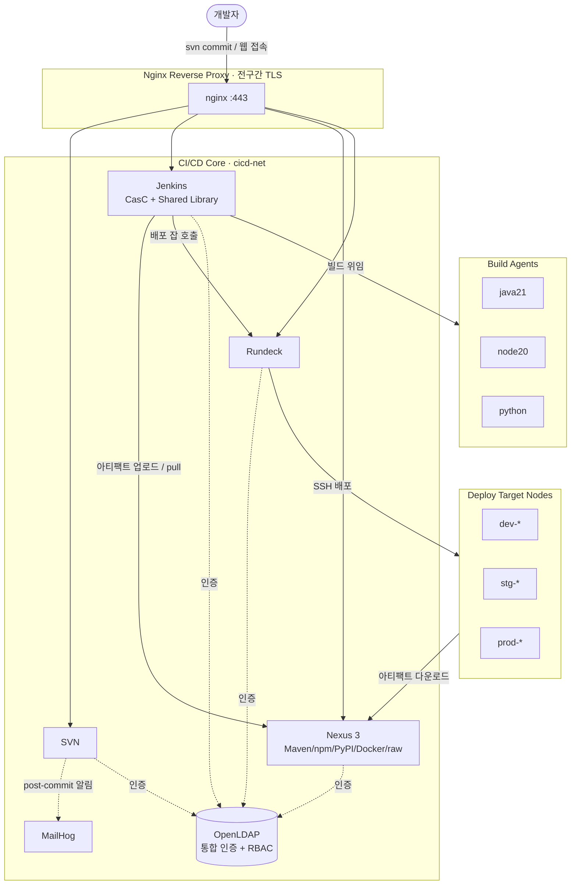
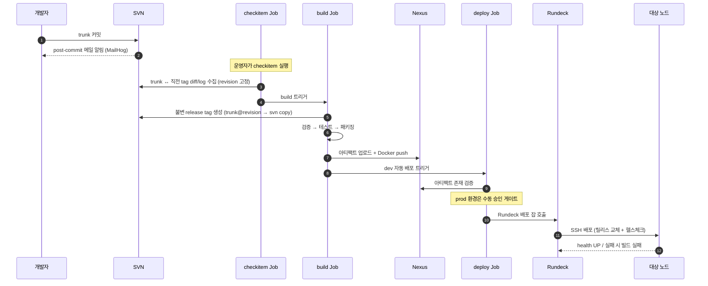

# Legacy CI/CD Modernization Platform
### 클라우드 전환 이전, 이미 운영 중인 온프렘 환경을 코드로 표준화·자동화한 DevOps 플랫폼

> 실제 운영하던 **온프렘 레거시 CI/CD 환경**을 코드로 재현하고, 표준화·자동화 관점에서 개선한 프로젝트입니다.
> SVN · Jenkins · Nexus · Rundeck · LDAP을 하나의 네트워크로 엮어 **커밋 → 빌드 → 배포** 흐름을 표준화했습니다.

클라우드 네이티브로 가기 전, 여전히 다수의 기업이 사용하는 온프렘 CI/CD 환경 — 그중에서도 **제가 실제로 운영하던 환경의 문제점을 직접 개선해보고자** 진행한 프로젝트입니다. 운영 중 마주한 오픈소스 EOS 상황을 염두에 두고, 그동안 운영하며 느낀 비효율을 표준화·자동화 관점에서 직접 다시 설계해본 작업입니다.

> **이 저장소의 범위**
> 본 저장소는 실제 운영 환경(약 2,000개 잡, 수백 대 배포 노드, Active Directory 인증)의 **표준화 구조를 3개 스택 샘플로 재현한 데모**입니다.
> 각 스택의 샘플 앱은 파이프라인 동작 검증용 최소 구성으로, 실제 비즈니스 로직은 포함하지 않습니다.
> 운영 환경의 규모·수치는 본문에서 "운영 환경"으로 명시하며, 데모로 측정한 값과 구분합니다.

---

## 핵심 요약

| 항목 | 내용 |
|------|------|
| VCS | Subversion (trunk/tags, post/pre-commit hook) |
| CI | Jenkins (Configuration as Code, Job DSL Seed, **Shared Library**) |
| Artifact | Nexus 3 (Maven / npm / PyPI / Docker / raw) |
| Deploy | Rundeck (환경별 dev/stg/prod, SSH 노드 오케스트레이션) |
| 인증 | **OpenLDAP 통합 인증(중앙 집중식 계정) + 서비스별 RBAC** |
| Proxy / TLS | Nginx 리버스 프록시, 사설 CA 기반 전 구간 TLS |
| 지원 스택 | **Spring(Maven) · React(Node) · FastAPI(Python)** |
| 인프라 | Docker Compose 3-Layer (core / build agents / deploy nodes) |

---

## 배경 및 개선

실제 운영하던 온프렘 형상관리 환경의 오픈소스들이 EOS(지원 종료)를 앞둔 상황에서, 버전 업그레이드 시점에 함께 풀고 싶었던 파이프라인 구조의 비효율을 직접 재현하고 표준화 관점에서 다시 설계해본 프로젝트입니다.

### 기존 운영 방식의 문제

하나의 릴리스를 올리는 데 환경별로 CI 단계를 반복 실행해야 했습니다.

- DEV: CI 잡 수동 실행
- SIT → PRD: `SIT CHECKITEM → BUILD → DEPLOY → PRD CHECKITEM → BUILD → DEPLOY`

즉 `CHECKITEM`·`BUILD`를 환경 수만큼 반복했고, 환경마다 별도 태그(DEV/SIT/PRD)가 생성되어 관리 포인트가 분산됐습니다. 같은 소스라도 환경마다 다시 빌드하므로 SIT와 PRD의 산출물이 물리적으로 서로 다른 바이너리였습니다. 운영 잡 기준 SIT CHECKITEM부터 PRD BUILD까지 약 1시간이 소요됐습니다.

### 개선 결과

| 항목 | 기존 | 개선 |
|------|------|------|
| 실행 구조 | 환경별 `CHECKITEM`·`BUILD` 반복 | `CHECKITEM → BUILD → DEPLOY` 1회 실행 후 deploy 잡 파라미터로 환경 선택 |
| 릴리스 태그 | 환경별 개별 생성 (DEV/SIT/PRD) | 빌드 1회당 불변 태그 1개 생성 → 관리 포인트 단일화 |

**핵심은 빌드 속도가 아니라 중복 실행 제거입니다.** `CHECKITEM`·`BUILD`를 환경마다 반복하지 않으므로, 운영 잡 기준 약 1시간이 30분 수준으로 단축될 것으로 추정합니다(실행 횟수가 절반으로 줄어든 데 따른 추정치이며, 본 데모는 소스 규모가 작아 절대 시간 비교 대상은 아닙니다).

---

## 이 프로젝트에서 증명하고 싶은 3가지

실제 운영하며 겪은 세 가지 문제와, 그것을 어떻게 구조적으로 해결했는지입니다.

### 1. Shared Library 기반 파이프라인 표준화

**문제.** 다수의 Jenkins 잡이 공통 로직을 각자 shell 스크립트로 복붙해 유지하고 있었습니다. 솔루션별로 담당자가 달라 빌드 플로우의 순서가 제각각이고, 환경변수 명명도 달라 후속 잡이 여러 환경변수를 중복 처리해야 했습니다. 결과적으로 **한 곳을 고치면 연관된 잡을 모두 함께 수정**해야 해 유지보수가 매우 어려웠습니다.

**해결.** 공통 step(checkitem/build/deploy)을 Groovy **Shared Library**로 추출하고, 빌드 플로우를 단일 계약으로 표준화했습니다. 각 잡의 Jenkinsfile은 차이값을 담은 **설정 Map만 넘기는 몇 줄**로 끝나고, 실제 로직은 라이브러리가 담당합니다. 수정 지점이 라이브러리 한 곳으로 모입니다.

서로 다른 빌드 체계(Spring=Maven, React=Node, FastAPI=Python)도 동일한 파이프라인 계약으로 통일했습니다. 스택이 늘어나도 새 파이프라인을 처음부터 짜지 않고 **스택 헬퍼 하나만 추가**하면 됩니다.

| 스택 | 빌드 | 산출물 | Nexus 저장소 |
|------|------|--------|--------------|
| Spring | `mvn clean verify / deploy` | jar | `maven-releases` |
| React | `npm ci && build` | tar.gz | `react-releases` (raw) |
| FastAPI | `pytest` + 패키징 | tar.gz | `fastapi-releases` (raw) |

```
cicd-shared-library/vars/
├── checkitemPipeline.groovy   # 변경분 수집 → 빌드 트리거
├── buildPipeline.groovy       # 불변 태그 → 빌드/테스트/패키징 → 업로드 → 배포 트리거
├── deployPipeline.groovy      # 아티팩트 검증 → (prod 승인) → Rundeck 배포
├── stackMaven.groovy          # Spring 스택 동작
├── stackNode.groovy           # React 스택 동작
├── stackPython.groovy         # FastAPI 스택 동작
├── svnHelper.groovy           # checkout / revision / diff / 불변 태그
├── nexusHelper.groovy         # 아티팩트 존재 검증
└── dockerHelper.groovy        # 레지스트리 로그인 / build / push
```

### 2. LDAP 그룹 기반 통합 인증·권한

**문제.** Jenkins·SVN·Nexus만 LDAP에 연동되어 있고 Rundeck은 계정·권한을 별도로 관리해야 했습니다. 게다가 SVN·Jenkins 권한이 **개인 단위**로 부여되어 있어, 인원이 늘면서 관리가 한계에 부딪혔습니다. 입·퇴사 때마다 여러 시스템에서 권한을 일일이 넣고 빼야 했습니다.

**해결.** Rundeck을 포함한 네 시스템이 **동일한 LDAP 디렉터리**를 바라보도록 통합하고, 권한을 **사람이 아니라 그룹(역할)에 부여**했습니다. 잡·리소스 권한을 그룹에 미리 정의해두고, 사용자를 그룹에 한 번만 넣으면 그 그룹의 권한이 일괄 적용됩니다. 입·퇴사 시 계정·그룹 멤버십 한 건만 정리하면 됩니다.

- LDAP `ou=users` / 그룹 기준 인증, LDAPS(TLS) 연동
- Jenkins: `projectMatrix` + 팀 폴더 권한으로 팀별 잡 접근 분리 (`payment` / `web` / `ml`)
- Rundeck: `JettyCombinedLdapLoginModule`로 동일 디렉터리 연동

> 네 시스템이 동일한 계정 저장소를 공유해 계정·권한을 한 곳에서 관리합니다. 다만 각 시스템 진입 시 로그인은 개별적으로 이뤄지며, 한 번 로그인으로 전 시스템을 넘나드는 토큰 기반 SSO는 아닙니다(아래 "알려진 한계" 참고).
>
> 운영 환경에서는 Windows Active Directory를 사용했으나, 본 데모는 Docker 기반이라 AD를 그대로 쓸 수 없어 OpenLDAP으로 재현했습니다.

### 3. 코드 기반 프로비저닝 (IaC)

**문제.** 운영에는 dev/sit/prd/hf-dev/hf-sit 5개 환경이 있어, TLS 인증서 교체 같은 작업 하나도 **5개 환경에 동일하게 반복**해야 했습니다. 수작업이라 휴먼 에러 가능성이 높고 시간도 오래 걸렸습니다. 기존과 동일한 새 프로젝트 환경 구축 요청을 받았을 때는, 수동 설치·구성·테스트에 **약 한 달**이 걸렸습니다.

**해결.** Jenkins를 비롯한 SVN·Nexus·Rundeck을 모두 **Docker 이미지로 만들고 초기화를 코드로 프로비저닝**했습니다. 환경 구성이 코드로 관리되므로, 동일 환경 재구축이나 공통 변경을 하루~이틀 안에 처리할 수 있습니다. 특히 Jenkins는 기존에 단일 서버에 Ant·Maven·Java 등 빌드 도구가 모두 설치돼 뒤섞여 있던 것을, **솔루션·버전별 빌드 에이전트 이미지로 분리**해 독립적으로 관리합니다.

---

## 아키텍처



---

## CI/CD 파이프라인 흐름

`checkitem → build → deploy` 3단계로 분리하여 **변경 추적성**과 **재현 가능한 릴리스**를 보장합니다.



### 단계별 핵심

- **checkitem** — 빌드 대상을 확정하는 단계. 운영자가 직전 릴리스 태그(`BASE_TAG`)를 선택하면, trunk와 해당 태그 사이의 변경 파일·커밋 로그를 추출해 `release-note.md`로 아카이빙하고, trunk의 현재 revision을 `checkitem.json`에 고정한다. 소스를 옮기지 않고 "무엇을, 어느 revision으로 빌드할지"만 결정한다.
- **build** — checkitem이 고정한 revision으로 `trunk@revision`을 **불변(immutable) release tag**로 직접 복사(`svn copy`)한다. 동일 태그가 이미 있으면 실패시켜 릴리스 충돌을 방지한다. 이후 그 태그를 받아 스택별 빌드/테스트/패키징 → Nexus 업로드 → Docker push → dev deploy 트리거. 메타데이터(`build-info.json`)는 fingerprint로 보존.
- **deploy** — 아티팩트 존재 검증 → **prod는 `input` 승인 게이트(타임아웃 30분)** → Rundeck 잡 호출. 대상 노드에서는 `releases/<release>` 디렉터리에 받고 `current` 심볼릭 링크를 교체, **최근 3개 릴리스 유지**, 헬스체크(최대 12회 × 5초)로 기동 확인.

> **참고 — 실제 운영 환경의 checkitem**
> 운영 환경에서는 SVN log에서 당월 Jira 티켓으로 커밋된 소스만 추출하는 로직이 있었습니다. 본 데모는 Jira 시스템 연동이 불가능하고, 태그 생성 시 변경분(partial)과 누적 소스(full)를 분리하는 과정도 소스 규모가 작아 구현하지 않았습니다. 따라서 checkitem을 "trunk diff + revision 고정", 태그 생성을 "trunk → tag 직접 복사"로 단순화했습니다.

---

## 기술적 의사결정 (Trade-offs)

실제 운영 환경(DEV/SIT/PRD + HF DEV/SIT, 약 2,000개 잡)을 재현하며 내린 선택과 이유입니다.

### 왜 도구를 유지·선택했는가

- **Jenkins** — 운영 환경에는 약 2,000개의 잡이 존재하며, 솔루션별로 빌드 도구만 다를 뿐 빌드·배포 플로우는 거의 동일합니다. 다른 CI로 전환할 경우 2,000개 잡의 마이그레이션 비용과 운영 중단 리스크가 전환의 이득을 크게 상회한다고 판단해, Jenkins를 유지하고 **파이프라인 구조 자체를 표준화**하는 방향을 택했습니다.
- **Shared Library** — 플로우가 거의 동일한 다수 잡이 각자 shell 스크립트를 복붙해 유지되던 구조였습니다. 공통 step을 Groovy 라이브러리로 추출해, 각 잡은 차이값만 설정으로 넘기고 공통 로직은 라이브러리가 담당하도록 했습니다. 변경 시 수정 지점이 라이브러리 한 곳으로 모입니다.
- **SVN** — 기존 커밋 이력을 그대로 승계해야 했고, checkitem 로직이 SVN log·tag 구조에 의존하므로 유지했습니다.
- **Nexus** — 사내에서 오래 사용해온 레거시 라이브러리를 그대로 이관해야 했습니다. 저장소를 바꾸면 의존성 해석이 깨질 위험이 있어 동일 저장소를 유지했습니다.
- **Rundeck** — 운영 환경은 쿠버네티스 전환 이전 단계의 VM 구성으로, 수백 대 노드에 SSH로 1:N 배포가 필요합니다. Jenkins에서 직접 배포하지 않고 Rundeck으로 분리해 노드 접근 권한과 배포 이력을 한 곳에서 일원화했습니다. 또한 Rundeck에 이미 약 1,000개의 배포 잡이 존재해, 다른 솔루션으로 전환할 경우의 마이그레이션 비용도 유지 결정의 한 이유였습니다.
- **Nginx 리버스 프록시** — 운영 환경에는 없던 구성이나, HTTPS 적용 방식을 통합하기 위해 추가했습니다. 기존에는 Jenkins·Nexus는 Tomcat `server.xml`, SVN·Rundeck은 각자 property 파일에 인증서 경로·URL을 일일이 지정해야 해서 도구마다 적용 방식이 달랐습니다. 프록시 앞단에서 TLS termination을 수행하면 인증서 관리와 TLS 정책을 한 곳으로 모으고, 도메인 기반 단일 진입점으로 뒷단 포트 노출도 줄일 수 있습니다.

### 그 밖의 설계 선택

- **post-commit은 빌드 트리거가 아니라 알림·메트릭 전용.** trunk 커밋 후 메일 전송과 커밋 이력을 Pushgateway로 전송하는 용도로 post-commit 훅을 구현했습니다. 커밋 후처리 훅은 실패해도 커밋을 되돌릴 수 없으므로 백그라운드 실행 + 항상 `exit 0`으로 설계해, 훅 오류가 커밋 자체에 영향을 주지 않게 했습니다. 빌드 시작 시점은 운영자가 checkitem으로 통제합니다.
- **불변 release tag.** 빌드 대상을 SVN 태그로 고정해, "그때 그 소스"를 언제든 동일하게 재현/추적할 수 있게 했습니다.
- **권한은 그룹 단위.** 사용자가 아닌 역할(그룹)에 권한을 부여해 계정 라이프사이클 관리 비용을 줄였습니다.

> **데모에서 단순화한 부분 (운영 ↔ 데모 차이)**
> - **pre-commit / 파이프라인 단계의 Jira 검증.** 운영 환경에서는 pre-commit 훅과 checkitem·build·deploy 단계가 모두 Jira 티켓을 검증하고 이력을 Jira에 기록했습니다. 본 데모는 Jira 연동이 불가능해 이 검증을 제외했습니다.
> - **prod 배포 승인.** 운영에서는 Jira의 승인 커멘트를 검증해 배포를 게이트했으나, 데모에서는 Jenkins의 `input` 승인 기능으로 대체했습니다.

---

## 운영 보조 — 백업 / 복구 / 로그 정리

데모 환경에도 실제 운영에서 수행하던 Day-2 운영 작업을 스크립트로 포함했습니다.

| 스크립트 | 역할 |
|----------|------|
| `scripts/backup.sh` | LDAP(slapcat LDIF) + Jenkins/Nexus/Rundeck/SVN(데이터 tar) 백업, 타임스탬프 보관, **7일 경과분 자동 삭제** |
| `scripts/restore.sh` | 백업본으로부터 복원(LDAP=slapadd, 그 외=tar 전개). 서비스 중지→복원→재기동, 확인 프롬프트, 부분 복원 지원 |
| `scripts/cleanup-logs.sh` | 바인드 마운트 로그(SVN 훅 등) 중 **30일 경과 로그 삭제** (`DRY_RUN` 지원) |

```bash
./scripts/backup.sh                      # 전체 백업 (7일 보관)
./scripts/restore.sh --list              # 백업 목록
./scripts/restore.sh 20260525_143012     # 특정 시점 전체 복원
./scripts/restore.sh 20260525_143012 svn # 특정 서비스만 복원
./scripts/cleanup-logs.sh                # 30일 경과 로그 정리
```

> 운영 환경에서는 SVN 레포지토리 수·리비전이 많아 `svnadmin dump`가 비현실적이라 rsync 기반 백업을 사용했고, Nexus 데이터도 rsync로 관리했습니다. 본 데모는 디스크 여유가 있어 tar로 단순화했습니다.

---

## 빠른 시작

> 사전 요구: Docker / Docker Compose, `/etc/hosts`에 `*.example.com` → 호스트 IP 매핑

```bash
# 1. 최초 1회 환경 초기화 (멱등 — 재실행 안전)
#    .env 생성, TLS 인증서, Rundeck SSH 키, /etc/hosts 도메인,
#    CA 신뢰, registry CA 등록 등을 한 번에 처리
./scripts/init.sh

# 2. 스택 기동 (core + 존재하는 보조 레이어 자동 기동)
./scripts/up.sh

#    core만 기동하려면
./scripts/up.sh core
```

| 서비스 | URL |
|--------|-----|
| Jenkins | https://jenkins.example.com |
| Nexus | https://nexus.example.com |
| Rundeck | https://rundeck.example.com |
| SVN | https://svn.example.com |
| MailHog (메일 확인) | http://localhost:8025 |

---

## 보안 주의 (데모 전용)

이 저장소는 **학습·시연 목적**입니다. 다음은 운영 환경에 그대로 사용하면 안 됩니다.

- `certs.sh`의 인증서 패스워드, `.env`의 기본 자격증명 등은 **데모용 더미값**입니다.
- 인증서/시크릿류는 `.gitignore`로 커밋에서 제외되어 있습니다.
- 운영 적용 시 Vault 등 외부 시크릿 관리 도입을 전제로 합니다.

---

## 알려진 한계

데모의 성격상 또는 사용 중인 오픈소스 라이선스 계층상 다음 한계가 있습니다. 함께 적은 것은 개선 방향입니다.

### 배포 중 다운타임 존재

배포는 `stop → current 심볼릭 링크 교체 → start` 방식으로, 기존 프로세스를 종료하고 새 릴리스를 기동합니다. 심볼릭 링크 교체 자체는 원자적이지만 프로세스를 재기동하므로 **짧은 다운타임이 존재**합니다. 무중단 배포(블루-그린/롤링)는 단일 호스트 범위를 벗어나며, 컨테이너 오케스트레이션 전환 시 자연스럽게 확보될 영역으로 봅니다.

### 롤백은 수동 방식

헬스체크 실패 시 자동 롤백은 하지 않으며, 배포 잡에서 이전 릴리스 형상(아티팩트)을 선택해 재배포하는 **수동 롤백** 방식입니다. 이는 실제 운영 환경과 동일한 정책으로, 노드에 최근 3개 릴리스를 보관해 수동 롤백에 대비합니다. 헬스체크 실패 시 직전 릴리스 자동 복구는 개선 후보입니다.

### 단일 호스트 구성 (HA 미적용)

학습·시연 목적의 의도적 범위 제한으로, 핵심 컴포넌트가 단일 인스턴스이며 단일 장애점(SPOF)이 존재합니다. 특히 LDAP은 4개 시스템의 공통 인증 의존성이라 HA 우선순위가 가장 높습니다. 고가용성 확보 방안은 컴포넌트마다 다릅니다.

- **OpenLDAP** — OSS에서 디렉터리 복제(replication)를 지원하므로 다중 인스턴스 + 로드밸런싱으로 이중화 가능.
- **Nexus** — HA 클러스터링은 **Pro(상용) 라이선스 전용 기능**으로, OSS로는 단일 인스턴스가 한계. 오케스트레이션 전환만으로는 해결되지 않으며 라이선스 도입이 전제됨.
- **Jenkins** — 컨트롤러는 액티브-스탠바이 수준, 빌드 에이전트는 수평 분산 가능.

### 토큰 기반 SSO 미적용

네 시스템이 공통 LDAP 디렉터리로 계정을 통합했으나, 한 번 로그인으로 전 시스템을 넘나드는 SAML/OIDC 기반 SSO는 적용하지 않았습니다. 도구별로 지원 범위가 다릅니다.

- **Jenkins** — 플러그인을 통해 SAML/OIDC SSO 연동 가능.
- **Nexus** — SSO 연동 가능.
- **Rundeck** — SAML/OIDC는 상용(Enterprise) 기능. OSS 범위 밖.
- **SVN** — SSO 개념을 지원하지 않음.

따라서 현재는 통합 디렉터리 인증으로 한정했습니다. 향후 **Rundeck → Argo CD, SVN → GitLab/GitHub** 전환 시 OIDC 기반 전 구간 SSO 적용이 가능해집니다.

---

## 향후 개선 과제 (Roadmap)

현재 범위에서 의도적으로 제외했거나, 다음 단계로 확장할 수 있는 영역입니다.

- **통합 권한·계정 관리 시스템** — 현재 LDAP 디렉터리와 각 시스템 권한은 LDIF·설정 기반의 수동 관리입니다. 이를 자동화해 **SVN·Jenkins·Nexus·Rundeck 권한 조회/부여/회수**와 **LDAP 사용자 계정 생성/수정/삭제**를 한 화면에서 처리하는 셀프서비스 관리 시스템으로 확장할 수 있습니다. (입·퇴사 및 권한 변경 처리의 운영 비용 절감)
- **LDAP 패스워드 정책(ppolicy)** — 로그인 실패 횟수 기반 계정 잠금, 패스워드 만료(90일), 최소 길이·재사용 금지 등 정책 적용. 적용용 LDIF·init 스크립트와 검증 절차를 `identity/ldap/`에 작성해두었으며, 실 환경 검증 후 본 구성에 반영할 예정입니다.
- **셀프서비스 패스워드 변경** — 사용자가 직접 LDAP 패스워드를 변경하는 페이지. 위 통합 관리 시스템과 함께 별도 프로젝트로 구현 예정.
- **관측성** — Prometheus/Grafana 메트릭, 중앙 로그 수집.
- **호스트 프로비저닝 IaC** — Terraform/Ansible로 배포 노드 자체를 코드화.
- **외부 시크릿 관리** — Vault 등 연동(현재는 `.env`/파일 기반).
- **환경 설정 외부화 표준화** — 현재 React만 `runtime-config-<env>.js`로 배포 시점 설정을 주입합니다. 빌드 산출물을 환경 중립적으로 유지하고 전 스택에서 설정을 배포 시점에 주입하는 방식으로 표준화하면, 동일 아티팩트를 전 환경에 승격할 수 있습니다.
- **고가용성(HA)** — 위 "알려진 한계" 참고.

---

## 디렉터리 구조

```
.
├── compose/                        # Docker Compose 레이어
│   ├── cicd.yml                    #   코어 스택 (cicd-net 생성)
│   ├── agents.yml                  #   빌드 에이전트
│   └── nodes.yml                   #   배포 대상 노드
├── scripts/                        # 운영 스크립트
│   ├── certs.sh                    #   사설 CA / TLS 일괄 생성
│   ├── up.sh / down.sh / init.sh   #   스택 기동 / 종료 / 초기화
│   ├── backup.sh / restore.sh      #   데이터 백업 / 복구
│   └── cleanup-logs.sh             #   로그 정리
├── cicd/
│   ├── jenkins/                    #   CasC, 플러그인, Seed Job
│   ├── nexus/                      #   저장소/권한 초기화 템플릿
│   ├── rundeck/                    #   프로젝트·배포 잡·스크립트
│   ├── svn/                        #   훅, 인증, Shared Library, 샘플 앱
│   │   └── seed/cicd-shared-library/   # ★ 파이프라인 공통 라이브러리
│   ├── agents/                     #   빌드 에이전트 이미지
│   └── nodes/                      #   배포 대상 노드 이미지
├── identity/ldap/                  # 디렉터리 부트스트랩 LDIF / 인증서
└── ingress/nginx/                  # 리버스 프록시 설정
```
