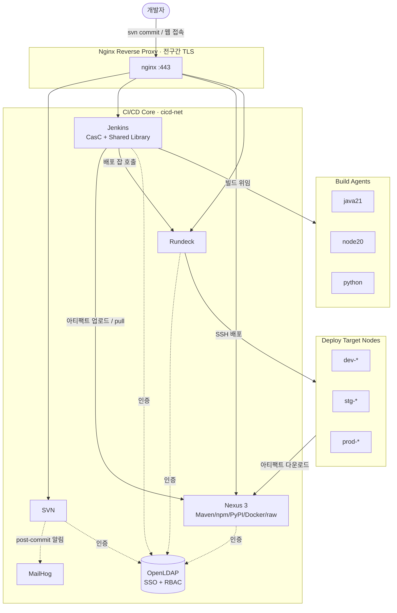
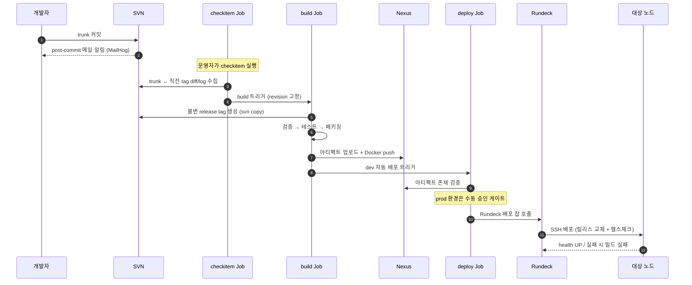

# Legacy CI/CD Pipeline

> 실제 운영하던 **온프렘 레거시 CI/CD 환경**을 코드로 완전히 재현하고, 표준화·자동화 관점에서 개선한 프로젝트입니다.
> SVN · Jenkins · Nexus · Rundeck · LDAP을 하나의 네트워크로 엮어, **커밋 → 빌드 → 배포**까지 사람 손을 거의 타지 않는 파이프라인으로 만들었습니다.

클라우드 네이티브로 가기 전, 여전히 다수의 기업이 운영 중인 **브라운필드(on-prem, SVN/Jenkins 기반) 환경을 직접 운영·표준화·자동화할 수 있다**는 것을 보여주는 데 목적이 있습니다.

---

## 핵심 요약

| 항목 | 내용 |
|------|------|
| VCS | Subversion (trunk/tags, post/pre-commit hook) |
| CI | Jenkins (Configuration as Code, Job DSL Seed, **Shared Library**) |
| Artifact | Nexus 3 (Maven / npm / PyPI / Docker / raw) |
| Deploy | Rundeck (환경별 dev/stg/prod, 노드 오케스트레이션) |
| 인증 | **OpenLDAP 단일 인증(SSO) + 서비스별 RBAC** |
| Proxy / TLS | Nginx 리버스 프록시, 사설 CA 기반 전 구간 TLS |
| 지원 스택 | **Spring(Maven) · React(Node) · FastAPI(Python)** |
| 인프라 | Docker Compose 3-Layer (core / build agents / deploy nodes) |

---

## 이 프로젝트에서 증명하고 싶은 3가지

### 1. LDAP 통합 인증 (SSO + RBAC)

Jenkins · Rundeck · Nexus · SVN 네 시스템이 **각자 계정을 두지 않고** OpenLDAP 하나를 바라봅니다.
계정·권한을 한 곳에서 관리하고, 시스템별로 흩어지던 인증을 단일화했습니다.

- LDAP `ou=users` / `ou=roles` 기준 인증, LDAPS(TLS) 연동
- Jenkins: `projectMatrix` + 팀 폴더 권한으로 **팀별 잡 접근 분리** (`payment` / `web` / `ml`)
- Rundeck: `JettyCombinedLdapLoginModule`로 동일 디렉터리 연동
- 권한은 "사람"이 아니라 "그룹(역할)"에 부여 → 입·퇴사 시 계정 한 건만 정리하면 끝

### 2. 멀티스택 표준화

서로 다른 빌드 체계(Spring=Maven, React=Node, FastAPI=Python)를 **하나의 동일한 파이프라인 계약**으로 통일했습니다.
스택이 늘어나도 새 파이프라인을 처음부터 짜지 않고, **스택 헬퍼 하나만 추가**하면 됩니다.

| 스택 | 빌드 | 산출물 | Nexus 저장소 |
|------|------|--------|--------------|
| Spring | `mvn clean verify / deploy` | jar | `maven-releases` |
| React | `npm ci && build` | tar.gz | `react-releases` (raw) |
| FastAPI | `pytest` + 패키징 | tar.gz | `fastapi-releases` (raw) |

세 스택 모두 **동일한 단계(검증 → 테스트 → 패키징 → Nexus 업로드 → Docker push → 배포 트리거)** 를 따릅니다.

### 3. Shared Library 기반 파이프라인 설계

파이프라인을 잡마다 복붙하지 않고, 공통 로직을 라이브러리로 추출해 **소프트웨어 엔지니어링 원칙(DRY · 관심사 분리 · 설정 계약)** 을 적용했습니다.

```
cicd-shared-library/vars/
├── checkitemPipeline.groovy   # 변경분 수집 → 빌드 트리거
├── buildPipeline.groovy       # 불변 태그 → 빌드/테스트/패키징 → 업로드 → 배포 트리거
├── deployPipeline.groovy      # 아티팩트 검증 → (prod 승인) → Rundeck 배포
├── stackMaven.groovy          # Spring 스택 동작
├── stackNode.groovy           # React 스택 동작
├── stackPython.groovy         # FastAPI 스택 동작
├── svnHelper.groovy           # checkout / revision / diff / 불변 태그
├── nexusHelper.groovy         # 아티팩트 존재 검증
└── dockerHelper.groovy        # 레지스트리 로그인 / build / push
```

각 잡의 Jenkinsfile은 **설정 Map만 넘기는 몇 줄**로 끝납니다. 실제 로직은 라이브러리가 담당합니다.

---

## 아키텍처



---

## CI/CD 파이프라인 흐름

`checkitem → build → deploy` 3단계로 분리하여 **변경 추적성**과 **재현 가능한 릴리스**를 보장합니다.



### 단계별 핵심

- **checkitem** — trunk와 직전 릴리스 태그 사이의 변경 파일·커밋 로그를 수집해 `release-note.md`로 아카이빙. 어떤 revision을 빌드할지 고정.
- **build** — `svn copy`로 **불변(immutable) release tag**를 만든 뒤 그 태그를 빌드. 같은 태그 재생성 시 실패 처리해 릴리스 충돌 방지. 산출물은 Nexus 업로드 + Docker push, 메타데이터(`build-info.json`)는 fingerprint로 보존.
- **deploy** — 아티팩트 존재 검증 → **prod는 `input` 승인 게이트** → Rundeck 잡 호출. 대상 노드에서는 `releases/<release>` 디렉터리에 받고 `current` 심볼릭 링크를 원자적으로 교체, **최근 3개 릴리스 유지**, 헬스체크 통과까지 확인(롤백 친화 구조).

---

## 빠른 시작

> 사전 요구: Docker / Docker Compose, `/etc/hosts`에 `*.example.com` → 호스트 IP 매핑

```bash
# 1. 환경변수 준비
cp .env.example .env      # 비밀번호 등 값 수정

# 2. 사설 CA / TLS 인증서 생성
./certs.sh

# 3. 코어 스택 기동
docker compose up -d

# 4. (선택) 빌드 에이전트 + 배포 대상 노드까지
docker compose -f docker-compose.yml -f docker-compose.agents.yml -f docker-compose.nodes.yml up -d
```

| 서비스 | URL |
|--------|-----|
| Jenkins | https://jenkins.example.com |
| Nexus | https://nexus.example.com |
| Rundeck | https://rundeck.example.com |
| SVN | https://svn.example.com |
| MailHog (메일 확인) | http://localhost:8025 |

---

## 기술적 의사결정 (Trade-offs)

실제 운영 환경을 재현하며 내린 선택과 이유입니다.

- **post-commit은 빌드 트리거가 아니라 알림 전용.** 커밋 후처리 훅은 실패해도 커밋을 되돌릴 수 없으므로 백그라운드 실행 + 항상 `exit 0`으로 설계했습니다. 빌드 시작 시점은 운영자가 checkitem으로 통제합니다.
- **불변 release tag.** 빌드 대상을 SVN 태그로 고정해, "그때 그 소스"를 언제든 동일하게 재현/추적할 수 있게 했습니다.
- **배포를 Rundeck로 분리.** Jenkins(빌드)와 배포 실행 주체를 분리해, 노드 접근 권한·배포 이력을 Rundeck에서 일원화했습니다.
- **권한은 그룹 단위.** 사용자가 아닌 역할(그룹)에 권한을 부여해 계정 라이프사이클 관리 비용을 줄였습니다.

---

## ⚠️ 보안 주의 (데모 전용)

이 저장소는 **학습·시연 목적**입니다. 다음은 운영 환경에 그대로 사용하면 안 됩니다.

- `certs.sh`의 인증서 패스워드, `.env`의 기본 자격증명 등은 **데모용 더미값**입니다.
- 인증서/시크릿류는 `.gitignore`로 커밋에서 제외되어 있습니다.
- 운영 적용 시 Vault 등 외부 시크릿 관리 도입을 전제로 합니다.

---

## 의도적으로 범위에서 제외한 것 (Out of Scope)

레거시 운영·표준화에 집중하기 위해 아래는 의도적으로 다루지 않았습니다. 향후 확장 후보입니다.

- **관측성** — Prometheus/Grafana, 중앙 로그 수집
- **호스트 프로비저닝 IaC** — Terraform/Ansible로 노드 자체를 코드화
- **고가용성(HA)** — 현재는 단일 호스트 구성
- **외부 시크릿 관리** — Vault 등 연동

---

## 디렉터리 구조

```
.
├── docker-compose.yml              # 코어 스택
├── docker-compose.agents.yml       # 빌드 에이전트
├── docker-compose.nodes.yml        # 배포 대상 노드
├── certs.sh                        # 사설 CA / TLS 일괄 생성
├── jenkins/                        # CasC, 플러그인, Seed Job
├── nexus/                          # 저장소/권한 초기화 템플릿
├── rundeck/                        # 프로젝트·배포 잡·스크립트
├── svn/                            # 훅, 인증, Shared Library, 샘플 앱
│   └── seed/cicd-shared-library/   # ★ 파이프라인 공통 라이브러리
├── ldap/                           # 디렉터리 부트스트랩 LDIF
└── nginx/                          # 리버스 프록시 설정
```
