# Enterprise DevOps Platform

> 레거시 사내 CI/CD 환경(Jenkins · SVN · Nexus · Rundeck)을 **코드 한 벌로 재현**하고,
> 표준화된 배포 파이프라인과 관측 체계를 더한 온프레미스형 DevOps 플랫폼


🔗 **Repository:** https://github.com/ghkimdev/enterprise-devops-platform

---

## 목차

- [한눈에 보기](#한눈에-보기)
- [프로젝트 배경](#프로젝트-배경)
- [아키텍처](#아키텍처)
- [실제 운영 환경과의 차이](#실제-운영-환경과의-차이)
- [기술 스택](#기술-스택)
- [CI/CD 파이프라인](#cicd-파이프라인)
- [기술적 의사결정 & 트레이드오프](#기술적-의사결정--트레이드오프)
- [관측성(Observability)](#관측성observability)
- [보안 · 운영 성숙도](#보안--운영-성숙도)
- [빠른 시작](#빠른-시작)
- [프로젝트 구조](#프로젝트-구조)
- [한계 & 향후 개선](#한계--향후-개선)

---

## 한눈에 보기

실제 운영 중인 사내 CI/CD 스택과 **동일한 도구 구성**을, 단일 명령으로 기동되는
Docker Compose 환경으로 재현한 개인 프로젝트입니다. 단순 CI 데모가 아니라
**인증 → 형상관리 → 빌드 → 아티팩트 → 배포 → 관측**까지 엔터프라이즈 내부 플랫폼 한 벌을 구성했습니다.

| 항목 | 내용 |
|------|------|
| 통합 오픈소스 도구 | 10종 이상 (Jenkins · SVN · Nexus · Rundeck · OpenLDAP · Nginx · Prometheus · Grafana · Loki · Alertmanager) |
| 실행 컨테이너 | 약 29개 (코어 10 · 관측 9 · 배포 대상 노드 10) |
| 표준 파이프라인 | 3개 스택(Java/Spring · Python/FastAPI · Node/React) × 3단계 = **9개** |
| 환경 구분 | dev / stg / prod 3-tier |
| 관측 자산 | Grafana 대시보드 5종 · Prometheus 알림 룰 27개 |
| 작업 형태 / 기간 | 개인 사이드 프로젝트 · 2025.05 ~ 2026.06 |

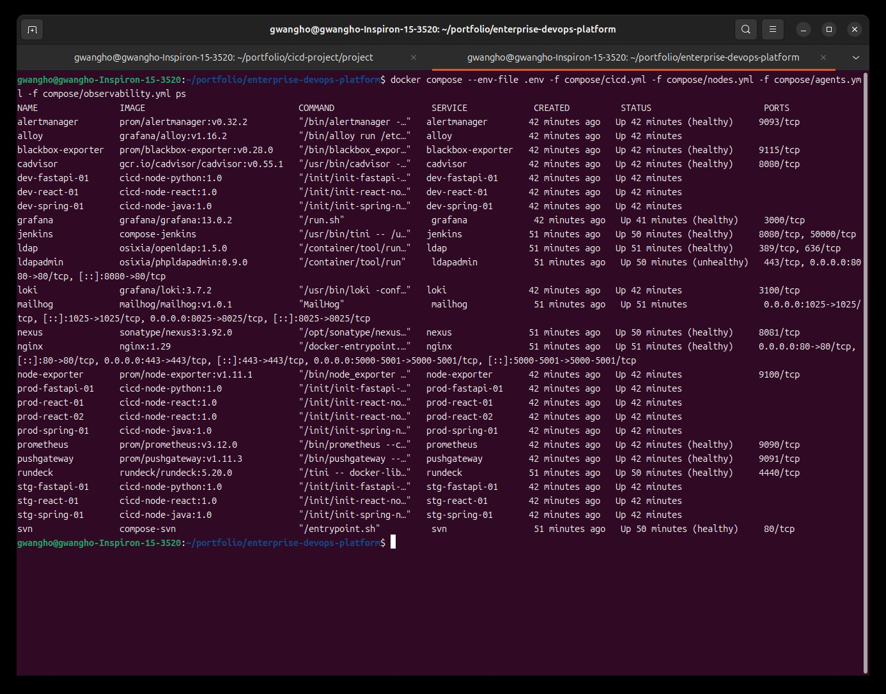

> `docker compose ... ps` — 코어 · 관측 · 배포 노드 전 컨테이너가 단일 명령으로 기동되어 `healthy` 상태를 유지합니다.

---

## 프로젝트 배경

소속 회사에서 사용 중인 CI/CD 도구들은 **2015년 구축 이후 한 번도 버전 업그레이드가 이뤄지지 않은** 상태였습니다.
누적된 보안 취약점(EOS, End of Service)으로 전면 버전업이 필요했고, 동시에 운영하며 느낀 비효율
— 잡마다 중복된 배포 스크립트, 배포 소요 시간·실패에 대한 가시성 부재 등 — 을 함께 개선해보고자 했습니다.

실제 사내 버전업 프로젝트는 일정상 보류되었지만, **"기존 도구와 데이터를 유지한 채 안전하게 현대화하려면 어떻게 설계해야 하는가"** 라는
질문을 끝까지 검증해보기 위해 개인 프로젝트로 끝까지 구현했습니다. 그래서 이 프로젝트의 모든 설계 결정은
"새 도구로의 무조건적 교체"가 아니라 **레거시 자산을 살리는 현실적 현대화**라는 제약을 전제로 내려졌습니다.

---

## 아키텍처

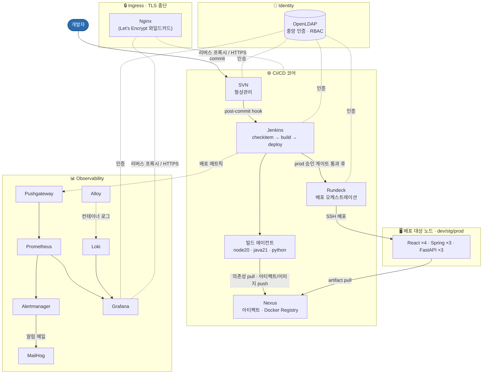

**레이어 구성**

| 레이어 | 구성 요소 | 역할 |
|--------|-----------|------|
| Ingress | Nginx + Let's Encrypt | 웹 서비스 5종의 TLS 종단 및 리버스 프록시 |
| Identity | OpenLDAP + phpLDAPadmin | Jenkins · Rundeck · Grafana · SVN 공통 중앙 인증(SSO) |
| CI/CD 코어 | SVN · Jenkins(+에이전트) · Nexus · Rundeck | 형상관리 → 빌드 → 아티팩트 → 배포 오케스트레이션 |
| 배포 대상 | dev/stg/prod × (React·Spring·FastAPI) 노드 | SSH 기반 배포 대상 인프라(VM) 시뮬레이션 |
| Observability | Prometheus · Pushgateway · Alertmanager · Alloy · Loki · Grafana | 메트릭 · 로그 · 알림 · DORA 추적 |

---

## 실제 운영 환경과의 차이

이 프로젝트는 실제 사내 CI/CD 스택과 **동일한 도구군·배포 흐름**을 따르되, 단일 호스트에서 재현 가능하도록 일부를 의식적으로 단순화하고, 일부 영역은 현대화 관점에서 새로 도입했습니다.

출발점은 *"수년간 업그레이드 없이 유지되어 여러 메이저 버전 뒤처진 EOS 상태의 도구들을, 도구 교체 없이 어떻게 안전하게 현대화할 것인가"* 였습니다. 그래서 동일 도구군을 **최신 안정 버전으로 고정**하고, 모든 버전을 코드(JCasC · Compose)로 명시해 동일 환경을 반복 재현·검증할 수 있게 구성했습니다.

| 영역 | 실제 운영 환경 | 본 프로젝트 | 비고 |
|------|----------------|-------------|------|
| 도구 버전 | 여러 메이저 버전 뒤처진 EOS | 최신 안정 버전 고정(코드 명시) | 현대화의 핵심 동기 |
| 호스팅 | 다중 호스트 분산 | 단일 호스트 Docker Compose | 학습·검증 목적 |
| 배포 대상 | VM (컨테이너/K8s 미도입) | 컨테이너 노드로 모사 | SSH 배포 흐름은 동일 |
| 컨테이너화 | 없음 | 빌드·배포 경로에 추가 도입 | 현대화 실험(데모선 push 비활성) |
| 자격증명 보호 | 전용 솔루션으로 암호화 저장 | `.env` / 파일 시크릿 | 상용 솔루션은 범위 외 |
| 정적 분석(SAST) | 상용 SAST 도구 운영 | 미적용 | 도구 의존 · 향후 과제 |
| 이미지 스캔 | 해당 없음(컨테이너 부재) | 컨테이너 도입 시 Trivy 등 연동 여지 | 현대화의 부수 이점 |
| 네트워크 | 망분리 · 방화벽 구간 | 단일 브리지(`cicd-net`) | 격리 정책은 미반영 |

> 요점은 **흐름과 구조는 운영과 동일하게 유지하되, 규모·격리·상용 솔루션 의존 영역만 단순화하거나 범위에서 제외**했다는 점입니다.
> 회사 식별·악용이 가능한 구체값(정확한 버전 번호 · OS · 보안 제품명)은 의도적으로 기재하지 않았습니다.

---

## 기술 스택

**CI/CD & 형상관리**
Jenkins (Configuration as Code) · SVN(Subversion) · Nexus Repository · Rundeck · Jenkins Shared Library(Groovy)

**인프라 & 런타임**
Docker · Docker Compose · Nginx · OpenLDAP

**관측성**
Prometheus · Alertmanager · Pushgateway · node-exporter · cAdvisor · blackbox-exporter · Grafana · Loki · Grafana Alloy

**빌드 대상 스택**
Java 21 / Spring · Python / FastAPI · Node 20 / React

---

## CI/CD 파이프라인

배포는 **checkitem → build → deploy** 3단계로 분리되어 있으며, 각 단계는 독립 Jenkins 잡으로 구성됩니다.

```
[checkitem]  배포 대상 리비전 사전 확정·검증
     │
     ▼
[build]      불변 SVN 태그 생성 → 빌드/테스트 → Nexus 업로드 → Docker 빌드·푸시(환경별 선택) → dev 자동 배포
     │
     ▼
[deploy]     아티팩트 검증 → (prod) 승인 게이트 → Rundeck 호출 → SSH 배포 → 배포 메트릭 전송
```

팀(web · payment · ml)별로 동일한 3단 구조가 표준화되어 있습니다.

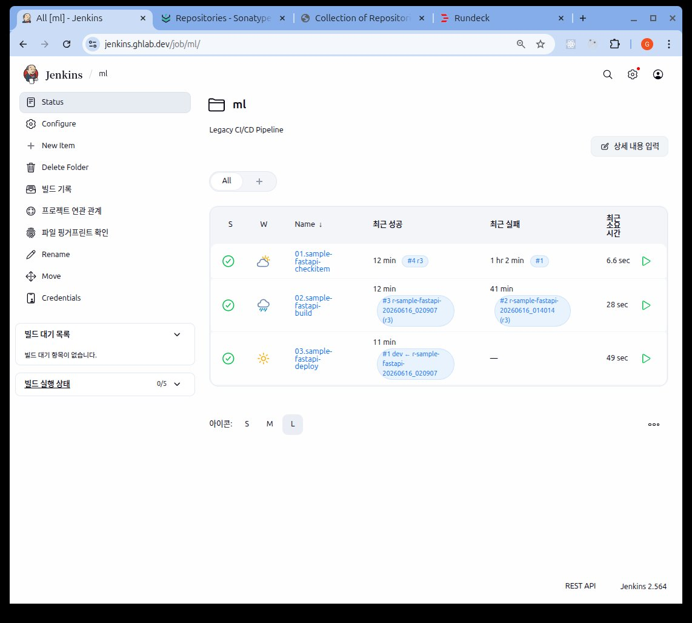

**빌드 단계 — 전 스테이지 통과**

빌드 잡은 파라미터 검증 → 불변 태그 생성 → 소스 검증 → 테스트/빌드 → Nexus 업로드 → Docker 빌드·푸시 → 메타데이터 아카이브 순으로 진행되며,
완료 시 릴리스명 · 아티팩트 URL · Docker 이미지 태그가 함께 기록됩니다.

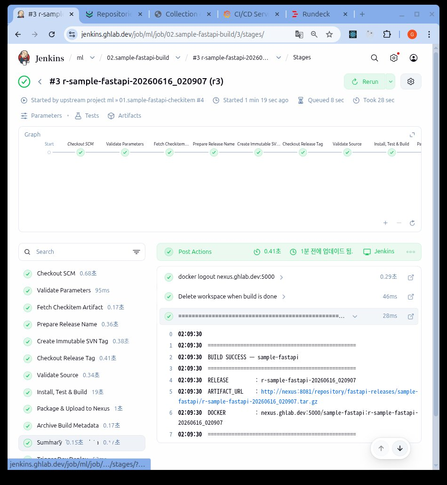

> **Docker 빌드·푸시 단계 참고:** 실제 운영 환경은 VM에 직접 배포하며 **컨테이너/Docker 레지스트리가 없습니다.**
> 본 프로젝트는 여기에 **컨테이너 기반 빌드·배포 경로를 추가로 도입(현대화 실험)** 한 것입니다.
> 다만 공개 데모 환경에서는 외부 인그레스(Cloudflare)가 레지스트리 커스텀 포트(5000) 접근을 차단해 이미지 푸시 단계를 비활성화했습니다.
> (위 화면은 레지스트리 접근이 가능한 환경에서 전체 단계가 실행된 결과입니다.)

**불변 릴리스 태그(SVN)**

빌드 시 `trunk`의 대상 리비전을 `tags/r-<app>-<timestamp>` 형식의 **불변 태그**로 고정합니다.
이후 배포는 이 태그를 기준으로만 이뤄지므로, 동일 릴리스의 재현과 추적이 보장됩니다.

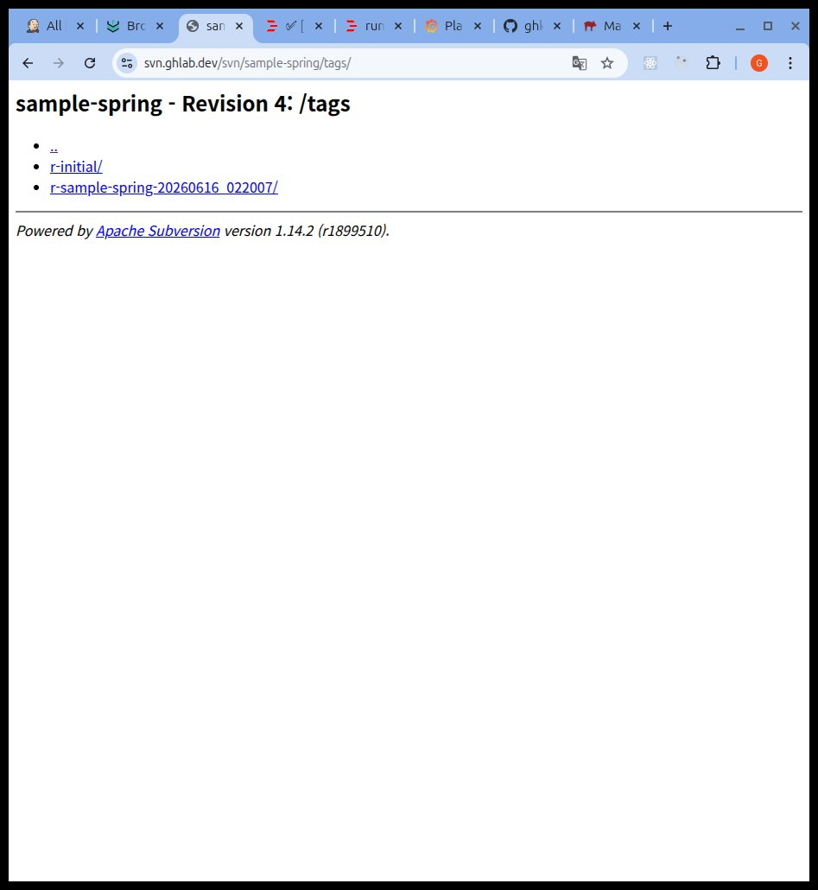

**prod 배포 승인 게이트**

dev 환경은 빌드 직후 자동 배포되지만, prod 배포는 반드시 **수동 승인(input)** 을 거칩니다.
승인 전까지 파이프라인이 대기하며, 승인된 경우에만 Rundeck 배포가 실행됩니다.

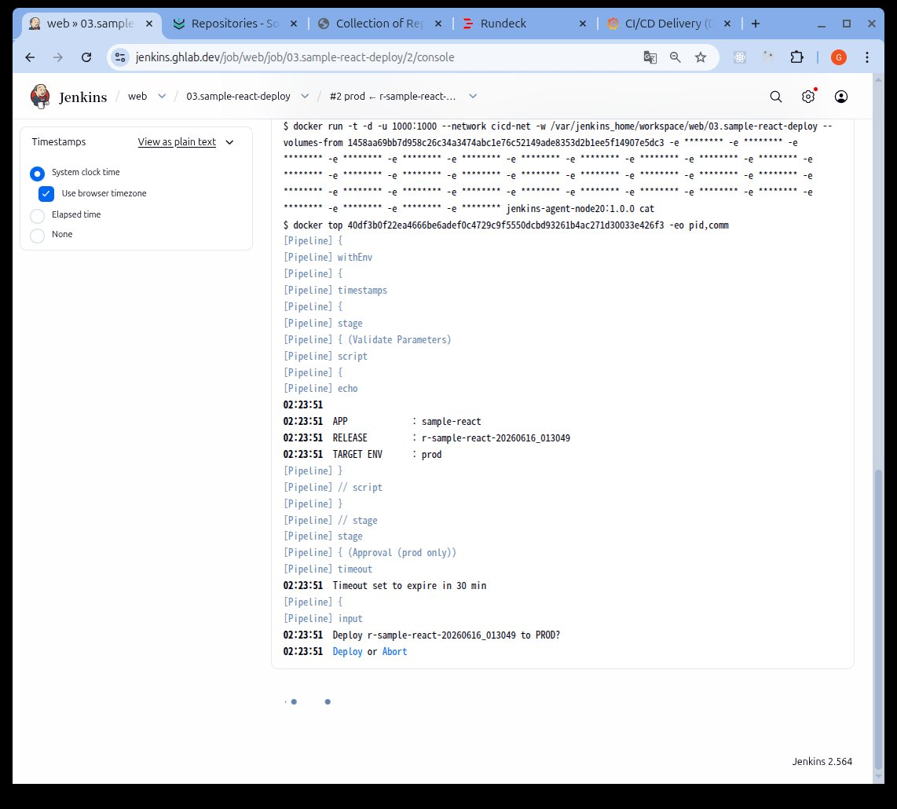

**Rundeck 다중 노드 배포**

deploy 단계는 Rundeck 잡을 호출해 대상 환경의 노드들에 SSH로 동시 배포합니다.
prod-react 배포 시 2개 노드(prod-react-01 / 02)에 모두 적용되고, 각 노드에서 헬스체크 통과를 확인합니다.

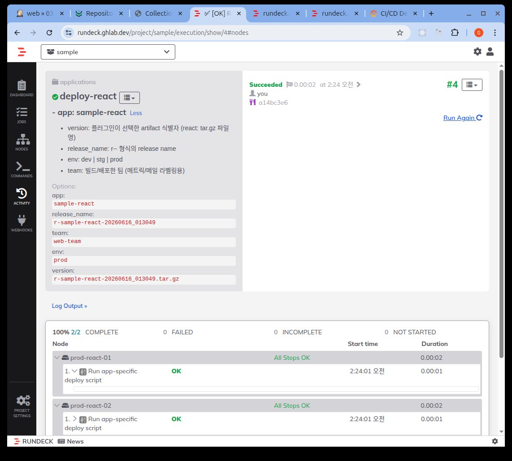

**아티팩트 관리(Nexus)**

raw · maven · npm · nuget · pypi · docker 등 다중 포맷 저장소를 운영하며,
빌드 산출물은 불변 릴리스명으로 버전 관리됩니다.

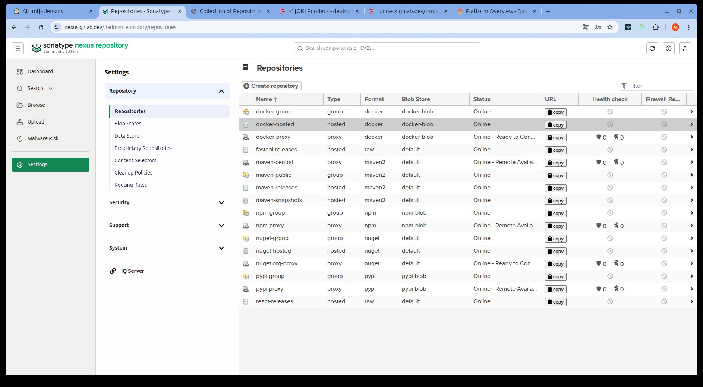

---

## 기술적 의사결정 & 트레이드오프

> 이 프로젝트에서 가장 신경 쓴 부분입니다. "무엇을 썼는가"보다 **"왜 그렇게 결정했는가"** 를 기록했습니다.

### 1. 도구 교체 대신 레거시 유지 — SVN · Jenkins · Nexus · Rundeck

배포 대상 서버가 아직 Kubernetes로 전환되지 않은 **VM 기반**이고, 기존 SVN에 마이그레이션해야 할 형상 데이터가 많았습니다.
새 도구(Git, GitOps 등) 도입은 학습·검증 기간과 데이터 전환 비용이 과도하다고 판단해,
**기존 아키텍처를 그대로 유지하면서 버전만 현대화**하는 방향을 택했습니다.
→ *트레이드오프:* 최신 GitOps 워크플로의 이점은 포기했지만, 현실적인 전환 비용과 운영 연속성을 확보했습니다.

### 2. Compose 파일을 레이어로 분리

전체 스택을 단일 `docker-compose.yml`로 관리하면 파일이 비대해져 유지보수가 어려워집니다.
`cicd.yml`(코어) · `observability.yml` · `nodes.yml` · `agents.yml`로 책임을 분리하고,
`up.sh`가 **올바른 기동 순서(base 이미지 빌드 → 코어 → 보조 레이어)** 를 보장합니다.
→ 코어만 띄우거나(`./up.sh core`) 관측·노드까지 전체를 띄우는 선택이 가능합니다.

### 3. 파이프라인 3단계 분리 — checkitem의 존재 이유

실제 운영 환경의 3단 구조를 그대로 반영했습니다. 특히 **checkitem** 단계는,
개발자가 많아질수록 모든 커밋을 일일이 관리하기 어려운 상황에서
**배포 나갈 리비전을 사전에 확정·검증**해 불필요하거나 미검증된 소스가 운영에 유입되는 위험을 구조적으로 차단합니다.

### 4. Jenkins Shared Library로 파이프라인 로직 통합

기존에는 잡마다 동일한 배포 로직(셸 스크립트)이 중복되어, 하나를 고치면 **모든 잡을 똑같이 수정**해야 했습니다.
공통 로직을 `buildPipeline` · `checkitemPipeline` · `deployPipeline` + 헬퍼로 추출해
**로직 1곳 수정 → 9개 파이프라인에 동시 반영**되도록 했습니다.
→ 유지보수 지점이 잡 수만큼(9개) → 1개로 수렴.

### 5. 코드 기반 프로비저닝(IaC)

Jenkins · Nexus · Rundeck · SVN을 JCasC · 초기화 스크립트 · seed 데이터로 코드화했습니다.
운영과 동일한 환경이 필요할 때 **`./init.sh && ./up.sh` 두 명령으로 전체를 재현**할 수 있습니다.
→ 테스트·검증용 동일 환경을 수동 구성 없이 빠르게 생성.

### 6. Pushgateway 기반 DORA 메트릭 수집

운영하면서 **배포가 오래 걸리는 문제와 배포 실패를 늦게 인지**하는 불편을 겪었습니다.
빌드 시간·성공률·배포 빈도를 추적하기 위해, 단명(short-lived)하는 배포 잡의 메트릭을
Pushgateway로 전송하고 Prometheus가 수집하도록 구성했습니다.
→ *"추적 불가 → 추적·알림 가능"* 으로 가시성을 확보(실제 운영에선 부재하던 역량).

---

## 관측성(Observability)

메트릭(Prometheus) · 로그(Loki) · 알림(Alertmanager)을 Grafana 하나로 통합 관측합니다.
대시보드 5종과 알림 룰 27개를 직접 구성했습니다.

**CI/CD Delivery (DORA)** — 배포 빈도 · 배포 소요시간 · 성공/실패 · 변경 실패율을 추적합니다.

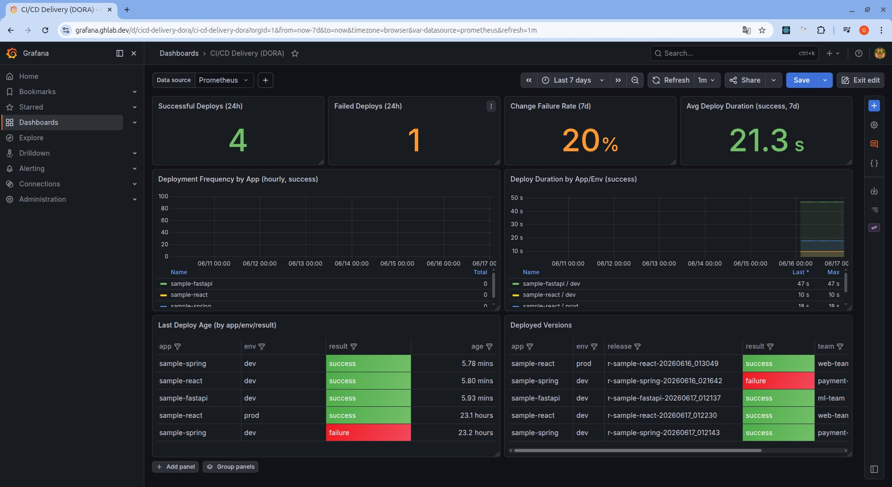


**Platform Overview** — 스크레이프 타깃 상태, 호스트 CPU/메모리/디스크, 발생 중 알림을 한눈에 확인합니다.

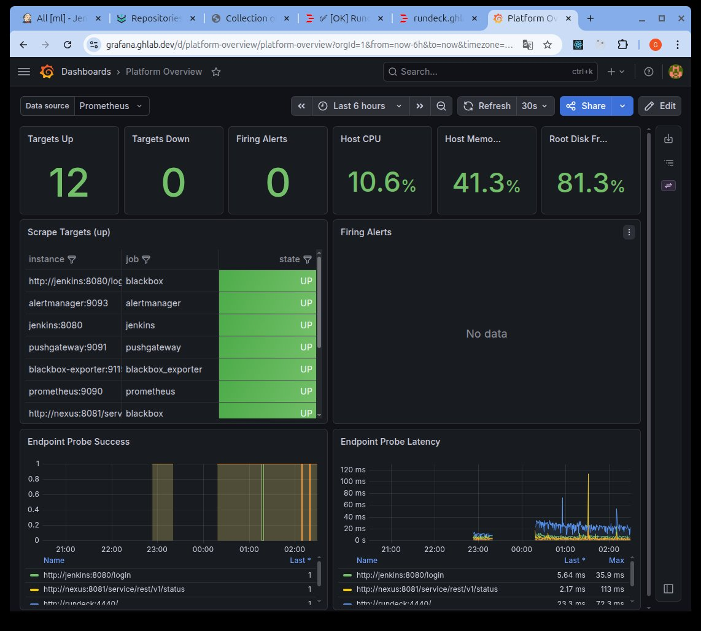

그 외 대시보드: **CI/CD Service Health**(Jenkins/Nexus JVM·큐·익스큐터), **Endpoint & SSL**(blackbox 프로브·인증서 만료), **Logs(Loki)**.

알림 룰은 인프라(호스트/컨테이너) · 엔드포인트 · CI/CD(Jenkins/Nexus) · 배포 실패 등 영역별로 분리해 관리하며,
발생 시 Alertmanager를 통해 메일(MailHog)로 통지됩니다. 빌드 실패(`JenkinsJobLastBuildFailed`)·배포 실패(`DeployFailed`) 등이
팀별 수신자에게 라우팅되어, 운영 중 빠른 인지·대응이 가능합니다.

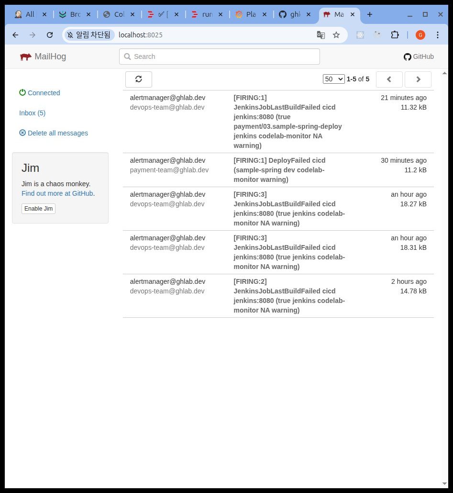

---

## 보안 · 운영 성숙도

- **TLS 일원화** — 웹 서비스 5종과 LDAP(ldaps)을 와일드카드 인증서로 통일, Nginx에서 종단.
- **중앙 인증(LDAP)** — Jenkins · Rundeck · Grafana · SVN · Nexus가 단일 LDAP 디렉터리로 인증, 계정·역할을 일원화.
- **최소 권한(전 도구 일관 적용)** — 인증을 넘어 도구별로 인가까지 분리했습니다.
  - **SVN** — `authz` 파일로 저장소·경로별 접근 권한 제어
  - **Jenkins** — `seed.groovy`로 역할 기반 권한(RBAC) 부여
  - **Nexus** — admin / developer 역할 분리 + LDAP 역할 외부 연동(external mapping)
  - **Rundeck** — LDAP 그룹(`ml-team`/`web-team`/`payment-team`)별 ACL로 잡 그룹·노드 태그까지 스코프 분리 (예: `ml-team` → `fastapi` 잡 + `sample-fastapi` 노드만 read/run)
- **시크릿 관리** — 비밀번호·메트릭 계정 등은 `.env`와 파일 시크릿으로 분리, `.gitignore`로 키/인증서 추적 제외. `.env.example`은 `<change-me>` 플레이스홀더 제공. *(상용 자격증명 암호화 솔루션 연동은 범위 외)*
- **네트워크 격리** — 서비스 간 통신을 전용 브리지 네트워크(`cicd-net`)로 한정.
- **백업 · 복구** — `backup.sh` / `restore.sh`로 주요 볼륨(데이터) 백업·복원 절차 제공.
- **헬스체크 & 기동 의존성** — 전 서비스에 healthcheck와 `depends_on` 조건을 정의해 안정적 기동 순서 보장.
- **불변 아티팩트** — 모든 배포 산출물이 SVN 태그 · Nexus 버전(컨테이너 도입 시 이미지 태그)으로 1:1 추적되어 재현·롤백 가능.

LDAP 디렉터리는 사용자(`ou=users`)와 역할(`ou=roles`)로 구성되며, 모든 도구가 이 단일 소스를 통해 인증·인가합니다.

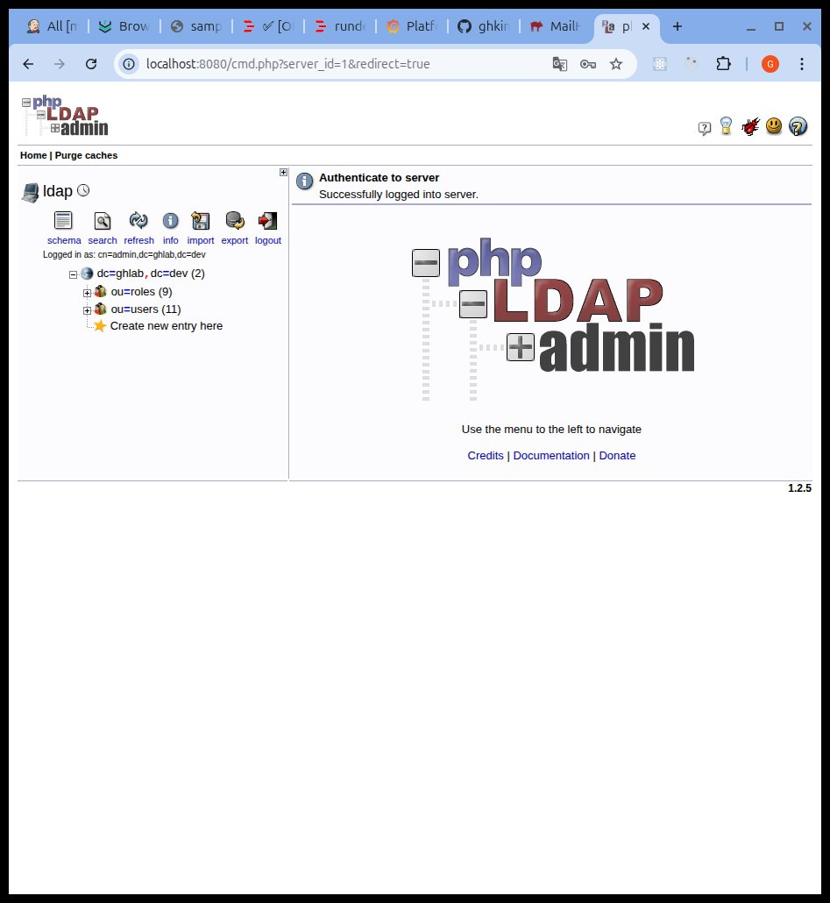

---

## 빠른 시작

### 사전 요구사항

- Docker / Docker Compose
- `*.ghlab.dev` 와일드카드 도메인과 Let's Encrypt 인증서 (웹 5종 + LDAP 커버)

```bash
# Let's Encrypt 와일드카드 발급 예시 (Cloudflare DNS)
sudo certbot certonly --dns-cloudflare \
  --dns-cloudflare-credentials /root/cf.ini \
  -d ghlab.dev -d '*.ghlab.dev'
```

### 설치 & 기동

```bash
# 1) 1회 환경 초기화 (멱등 — 재실행 안전)
#    .env 생성, 시크릿/SSH 키 생성, 인증서 배치
./scripts/init.sh

#    ⚠️ 생성된 .env 의 <change-me> 비밀번호 값을 반드시 수정

# 2) 전체 스택 기동 (base 이미지 빌드 → 코어 → 관측/노드/에이전트)
./scripts/up.sh

#    코어만 기동하려면:
./scripts/up.sh core

# 3) 종료
./scripts/down.sh
```

기동 후 각 서비스는 `https://<service>.ghlab.dev` 로 접근합니다 (jenkins · nexus · rundeck · grafana · svn).

---

## 프로젝트 구조

```
enterprise-devops-platform/
├── compose/              # 레이어별 Compose 정의
│   ├── cicd.yml          #   코어 (Nginx·Jenkins·Nexus·Rundeck·SVN·LDAP)
│   ├── observability.yml #   관측 스택
│   ├── nodes.yml         #   배포 대상 노드 (dev/stg/prod)
│   ├── agents.yml        #   Jenkins 빌드 에이전트 이미지
│   └── build.yml         #   노드 base 이미지
├── cicd/
│   ├── jenkins/          # JCasC · Dockerfile · seed
│   ├── nexus/            # 초기화 스크립트 · 저장소 템플릿
│   ├── rundeck/          # 프로젝트 · 잡 · 배포 키
│   ├── svn/              # 저장소 · 훅 · seed(샘플 앱 · 공유 라이브러리)
│   ├── agents/           # node20 · java21 · python 에이전트
│   └── nodes/            # 배포 대상 노드 이미지 · init 스크립트
├── identity/ldap/        # OpenLDAP 부트스트랩 LDIF · 인증서
├── ingress/nginx/        # 리버스 프록시 conf · 인증서
├── observability/        # prometheus · alertmanager · grafana · loki · alloy · blackbox
├── scripts/              # init · up · down · backup · restore
└── docs/                 # 도구별 운영 치트시트(Jenkins/Nexus/Rundeck/SVN/LDAP)
```

---

## 한계 & 향후 개선

현재 학습·검증 목적의 단일 호스트 구성이며, 다음 항목은 의도적으로 범위에서 제외했거나 향후 과제로 남겨두었습니다.

- **단일 호스트 / 비-HA** — 모든 서비스가 한 호스트에서 동작합니다. 실제 운영 적용 시 핵심 컴포넌트의 다중화·외부 DB 분리가 필요합니다.
- **VM 배포 대상의 컨테이너 시뮬레이션** — 배포 노드를 컨테이너로 모사했으며, 실제 VM/베어메탈과는 네트워크·권한 모델 차이가 있습니다.
- **컨테이너화는 현대화 실험** — 실제 운영에는 컨테이너/레지스트리가 없으며, 본 프로젝트가 추가로 도입한 영역입니다. 공개 데모에서는 외부 인그레스(Cloudflare)가 레지스트리 커스텀 포트(5000)를 차단해 이미지 푸시를 비활성화했습니다. 운영 적용 시에는 별도 레지스트리 도메인/포트 정책이 필요합니다.
- **GitOps 미적용** — 레거시 유지를 전제로 SVN 기반을 택했습니다. 점진적 Git 전환 및 선언형 배포는 후속 단계의 과제입니다.
- **시크릿 관리 고도화** — `.env`/파일 시크릿 수준이며, Vault 등 외부 시크릿 매니저 연동은 향후 개선 대상입니다.
- **DORA 지표의 실데이터 미연동** — 현재는 동작 검증 수준으로, 실제 배포 이력 기반의 지표 축적은 운영 적용 시 확보됩니다.

---

<sub>개인 사이드 프로젝트 · 2025.05 ~ 2026.06 · by ghkimdev</sub>
